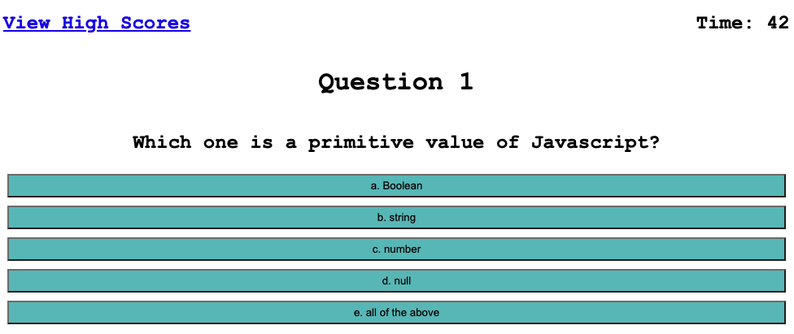

# Javascript Quiz Test Yourself
## Description
Quiz written in javascript, testing your javascript knowledge.

On the project learning: 
* Dynamically creating html elements
* Continual testing for accurate deployment
* Setting up Javascript for expected behavior
* DOM manipulation  

Challenges:
* CSS interactions with dynamically created html elements
* Effective and efficient deployment of html for functionality
* Set interval functionaility, putting the clearInterval in the place that gave expected behavior

## Built With
* Javascript, CSS, HTML
 

## Website
Visit the [project](https://violanerd.github.io/js-test-yourself/)

## Contribution

Developed by Madalyne Cross